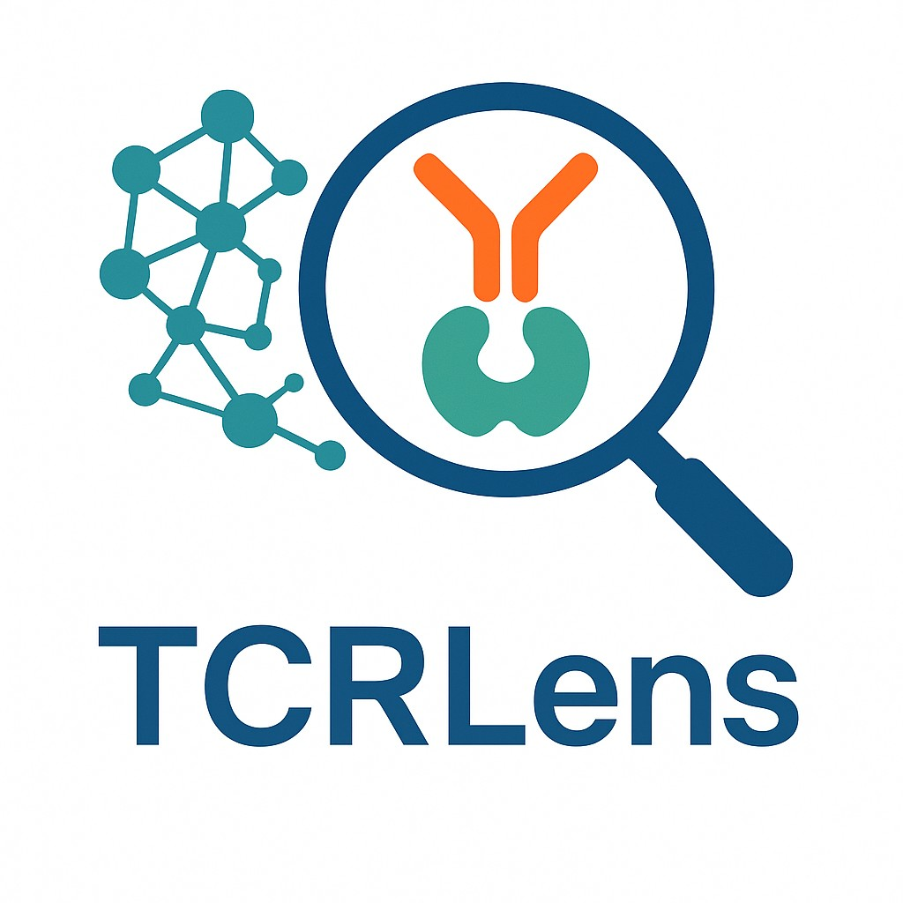

  

# TCRLens: Structure-Aware Equivariant Graph Learning for TCR-pMHC-I Recognition and Immunogenic Epitope Discovery
We introduce TCRLens, a structure-aware deep learning framework that models residue-level interactions across five critical interface zones using multi-scale graph representations and an equivariant graph neural network (EGNN).

# Requirements
To set up the conda environment, use the provided `environment.yml` file: 

`conda env create -f environment.yml` 
`conda activate TCRLens`

# Quick start
The raw structural data in PDB format and corresponding binding affinity information are stored in the `data_raw` directory.  
To generate interface graphs in HDF5 format, use the preprocessing scripts located in the `generated_script` folder.

The script `vae_gan.py` implements a Graph Variational Autoencoder combined with a Generative Adversarial Network (VAE-GAN) for **Generative Augmentation of Non-binding TCR-pMHC-I Interfaces**.  
It learns the structural distribution of experimentally resolved TCR-pMHC complexes and generates synthetic interface graphs to augment the training data.

All processed interface graphs in HDF5 format are stored in the `data_processed` directory.

- To perform validation on the dataset, use the `training_EGNN.py` script.
- For repeated k-fold cross-validation, use the `training_EGNN_rkFold.py` script.

Both `training_EGNN.py` and `training_EGNN_rkFold.py` will print performance metrics after training, including:

- **Precision**
- **Recall**
- **Accuracy**
- **F1-score**

#  Citation

If you use **TCRLens** in your research, please cite this repository.
Citation metadata is provided in [`CITATION.cff`](./CITATION.cff),  
You can also click the **"Cite this repository"** button at the top of the GitHub page to obtain citation formats like BibTeX or APA.

# License
This project is covered under the Apache 2.0 License.

